# RVITM Alumni Network 🎓

Welcome to the RVITM Alumni Network platform! This application serves as a central hub for alumni to connect, share updates, post media, and network with their peers.

## 🚀 Live Links

- **Frontend Application (Live UI):** [https://alumni-app-nine.vercel.app](https://alumni-app-nine.vercel.app) 
- **Backend API Server:** [https://alma-test-three.vercel.app](https://alma-test-three.vercel.app)

> [!NOTE]
> **To the Repository Owner:** To fix the "About" link on the right side of the GitHub page, click the `⚙️` (Settings gear) icon in the "About" section on the right, and paste `https://alumni-app-nine.vercel.app` into the "Website" field!

## 📱 Features

- **Dynamic Post Creation**: Attach images, PDFs, and documents natively or via drag-and-drop.
- **Real-time Feed**: See updates, connect with alumni, and stay up to date.
- **Alumni Profiles**: View and customize your personal alumni profile.
- **Cross-Platform**: Built with Expo and React Native for Web, iOS, and Android support.

## 📊 System Architecture & Flowchart

```mermaid
flowchart TD

%% ============================
%% USERS
%% ============================

Users([Users])

Users --> Alumni
Users --> Student
Users --> Admin
Users --> SuperAdmin

%% ============================
%% CLIENT APPLICATIONS
%% ============================

subgraph Client["Frontend Layer (React Native + Expo + JavaScript)"]

Mobile["📱 Android & iOS App"]
Web["💻 React Native Web"]

Login["Authentication"]
Dashboard["Dashboard"]
Profile["Profile"]
Jobs["Jobs"]
Events["Events"]
Mentorship["Mentorship"]
Chat["Chat"]
Notifications["Notifications"]
Settings["Settings"]
Legal["Terms • Privacy • Community Guidelines"]

Mobile --> Login
Web --> Login

Login --> Dashboard

Dashboard --> Profile
Dashboard --> Jobs
Dashboard --> Events
Dashboard --> Mentorship
Dashboard --> Chat
Dashboard --> Notifications
Dashboard --> Settings
Dashboard --> Legal

end

%% ============================
%% API
%% ============================

subgraph API["Backend (Node.js + Express.js)"]

APIGateway["REST API"]

Security["Security Middleware<br/>Helmet<br/>CORS<br/>MongoSanitize<br/>Rate Limiter<br/>JWT<br/>RBAC"]

Controllers["Controllers<br/>Authentication<br/>Users<br/>Posts<br/>Jobs<br/>Events<br/>Mentorship<br/>Chat<br/>Admin<br/>Super Admin<br/>Notifications"]

Business["Business Logic"]

end

Dashboard --> APIGateway

APIGateway --> Security

Security --> Controllers

Controllers --> Business

%% ============================
%% SERVICES
%% ============================

subgraph Services["Services"]

Socket["Socket.io<br/>Real-Time Chat"]

Firebase["Firebase Cloud Messaging<br/>Push Notifications"]

Email["SendGrid<br/>OTP<br/>Verification<br/>Email"]

Scheduler["Cron Jobs<br/>Email Reminders<br/>Cleanup<br/>Reports"]

end

Business --> Socket
Business --> Firebase
Business --> Email
Business --> Scheduler

%% ============================
%% DATABASE
%% ============================

subgraph Database["MongoDB Atlas (alumni_db)"]

UsersDB[(Users)]

PostsDB[(Posts)]

JobsDB[(Jobs)]

EventsDB[(Events)]

MentorshipDB[(Mentorship)]

MessagesDB[(Messages)]

NotificationDB[(Notifications)]

AuditDB[(Audit Logs)]

GridFS[(GridFS<br/>Images<br/>Documents<br/>Certificates<br/>Resumes)]

end

Business --> UsersDB
Business --> PostsDB
Business --> JobsDB
Business --> EventsDB
Business --> MentorshipDB
Business --> MessagesDB
Business --> NotificationDB
Business --> AuditDB
Business --> GridFS

%% ============================
%% SECURITY
%% ============================

Security --> JWT["JWT Authentication"]

Security --> Password["bcrypt Password Hashing"]

Security --> Validation["Input Validation"]

Security --> Roles["Role Based Access"]

%% ============================
%% ADMIN FLOW
%% ============================

Admin --> AdminPanel["Admin Dashboard"]

AdminPanel --> ApproveUsers["Approve Alumni"]

AdminPanel --> ManageEvents["Manage Events"]

AdminPanel --> ModeratePosts["Moderate Posts"]

AdminPanel --> Reports["Reports"]

SuperAdmin --> SuperPanel["Super Admin Dashboard"]

SuperPanel --> CollegeMgmt["Manage Colleges"]

SuperPanel --> AdminMgmt["Manage Admins"]

SuperPanel --> Analytics["Analytics"]

SuperPanel --> SystemConfig["System Settings"]

%% ============================
%% DEPLOYMENT
%% ============================

subgraph Deployment["Deployment Pipeline"]

GitHub["GitHub Repository"]

CI["GitHub Actions CI/CD"]

Docker["Docker"]

AWS["AWS EC2 / Vercel"]

Nginx["Nginx Reverse Proxy"]

HTTPS["SSL / HTTPS Encryption"]

PlayStore["Google Play Store"]

AppStore["Apple App Store"]

end

Business --> GitHub

GitHub --> CI

CI --> Docker

Docker --> AWS

AWS --> Nginx

Nginx --> HTTPS

HTTPS --> Mobile

HTTPS --> Web

Mobile --> PlayStore

Mobile --> AppStore

%% ============================
%% LEGAL & COMPLIANCE
%% ============================

subgraph Compliance["Legal & Compliance"]

Terms["Terms & Conditions"]

Privacy["Privacy Policy"]

Community["Community Guidelines"]

Retention["Data Retention"]

Delete["Account Deletion"]

Consent["User Consent"]

end

Login --> Consent

Consent --> Terms

Consent --> Privacy

Consent --> Community

Consent --> Retention

Consent --> Delete

Terms --> Dashboard
Privacy --> Dashboard
```



## 🛠️ Technology Architecture Flow

| Layer | Technology | Status |
| ----- | ---------- | ------ |
| **Web Frontend** | React.js / Expo Web | ✅ Implemented & Deployed |
| **Mobile Frontend** | React Native / Expo (iOS & Android) | ✅ Implemented |
| **Backend** | Node.js + Express | ✅ Implemented |
| **Database** | MongoDB Atlas | ✅ Connected |
| **ODM** | Mongoose | ✅ Active |
| **Authentication** | JWT + bcrypt | ✅ Active |
| **Real-time Chat** | Socket.IO (WSS) | ✅ Active |
| **Push Notifications** | Firebase Cloud Messaging (FCM) | ✅ Integrated |
| **Image/File Storage** | AWS S3 / Cloudinary / GridFS | ✅ Active |
| **Email** | Nodemailer | ✅ Active |
| **Version Control** | Git + GitHub | ✅ Synchronized |
| **CI/CD** | GitHub Actions | ✅ Configured |
| **Web Hosting** | Vercel (Frontend & Backend) | ✅ Live |
| **Mobile Distribution** | Google Play & App Store | ✅ Build Ready |
| **Monitoring** | Firebase Crashlytics & MongoDB Atlas Monitoring | ✅ Configured |

## 💻 Running Locally

1. Install dependencies:
   ```bash
   npm install
   ```

2. Start the Frontend & Backend:
   ```bash
   npm start
   ```
